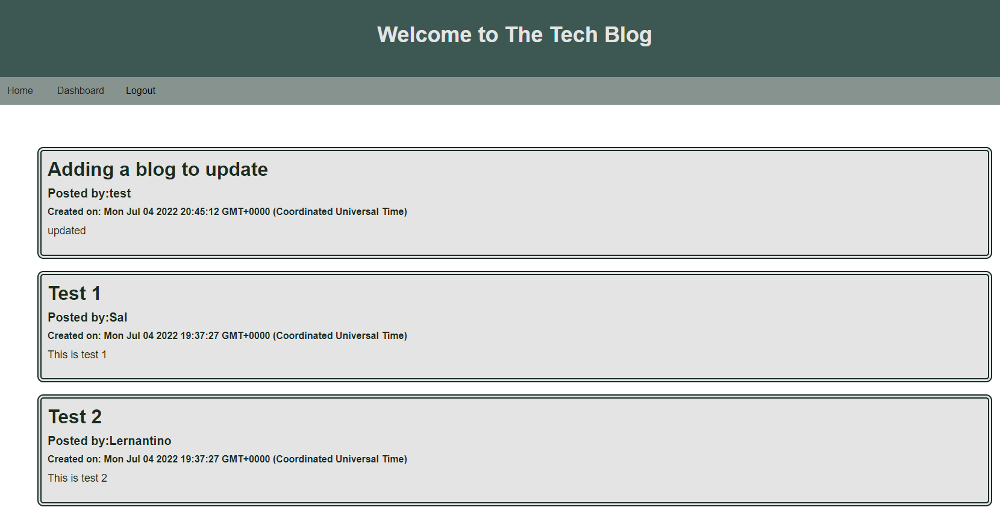
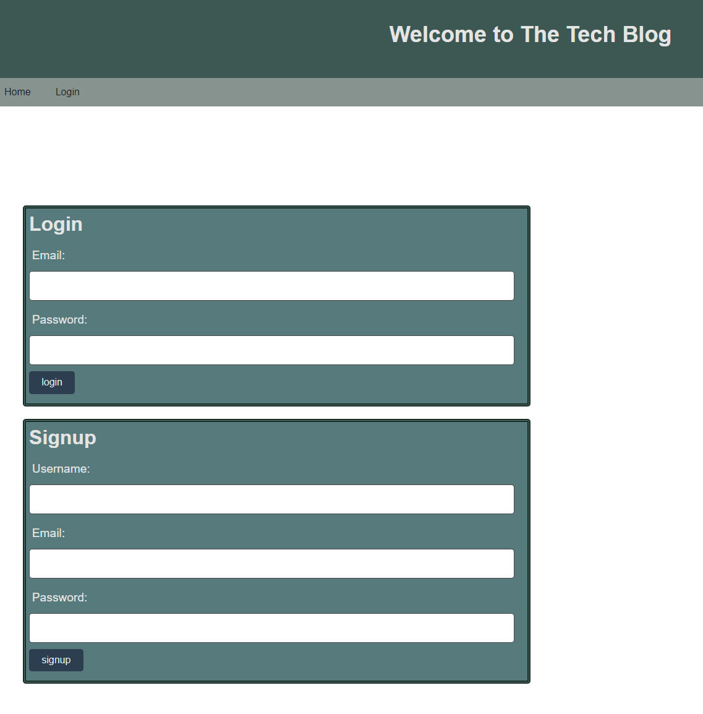

# Techblog Leveraging MVC, Sequalize and MySQL


    
## Description
    
This backend is a RESTful API that allows users to create, read, update, and delete products, categories anf tags.

## Table of Contents 

* [Installation](#installation)

* [Setting Up the Database](#setting-up-the-database)

* [Usage](#usage)

* [API](#API)

* [Screenshots](#screenshots)

* [Questions](#questions)

* [To Do](#ToDo)

## Installation
    
'npm i' to install the necessary dependencies.

Create a file named .env with the following contents:

```
DB_NAME=yourdbname
DB_USER=yourdbuser
DB_PASSWORD=yourdbpassword
DB_HOST=yourdbhost
DB_PORT=3306
PORT=3001
```

### Setting up the database

run schema.sql at a mySQL prompt to create the database and tables.
```
source ./db/schema.sql
```
Seed the database:
```
npm run seed
```
## Usage

After logging in you can see all blogs on the home page.

The dashboard will display all your blog posts.

Clickin on a title will take you to the blog post with ist comments.  Here you can amend and delet the post.

## API

An insomia collection can be found in this git repository

## Screenshots





## License
    
This project is licenced under MIT

## Questions

[More of my work can be found here](https://github.com/ChrisAylen)

## ToDo

The application needs better error messaging, tests, and a better UI.
